# Sentra

> An adversarial AI payment-fraud simulation and defense command center.

Sentra lets a **Red Team attack its own fraud-detection system**. It generates
evolving fraud scenarios, creates privacy-safe labeled transactions, scores
every transaction with supervised and anomaly-detection models, explains each
high-risk decision, and uses the results to propose a harder next attack round.

The project demonstrates an important idea: a fraud model should not only be
tested against yesterday's fraud. It should be continuously challenged by new
strategies before those strategies reach real customers.

- **Live dashboard:** [sentra-mu-lilac.vercel.app](https://sentra-mu-lilac.vercel.app/)
- **Backend health:** [sentra-e8kd.onrender.com](https://sentra-e8kd.onrender.com/)
- **API documentation:** [sentra-e8kd.onrender.com/docs](https://sentra-e8kd.onrender.com/docs)
- **Deployment instructions:** [DEPLOYMENT.md](DEPLOYMENT.md)

> **Data notice:** Sentra uses generated synthetic customers and transactions.
> It does not contain or claim to use real Mastercard or cardholder data.

## Why Sentra?

Payment-fraud systems face two connected problems:

1. Fraud strategies change after defenders learn their current patterns.
2. Real transaction data is sensitive, regulated, and difficult to use in a
   public prototype.

A static fraud classifier can report a high test score while remaining weak
against small behavioral changes. Sentra addresses this by combining a
privacy-safe simulator with an adversarial feedback loop:

1. The Red Team produces a schema-validated attack scenario.
2. The simulator generates legitimate, fraudulent, evasive, and hard-negative
   transactions.
3. The Blue Team scores the transactions with two complementary models.
4. A policy engine turns fused risk into operational decisions.
5. The dashboard reports performance and explains flagged cases.
6. Feedback identifies weaknesses and creates a mutated next-round scenario.

## What Makes It Different?

| Conventional fraud demo | Sentra |
| --- | --- |
| Tests a fixed dataset | Generates new labeled traffic for every run |
| Uses one fraud classifier | Combines XGBoost and Isolation Forest |
| Shows only an accuracy number | Shows precision, recall, F1, FPR, and a confusion matrix |
| Generates obvious fraud only | Includes evasive fraud and unusual-but-legitimate hard negatives |
| Returns a score | Produces `ALLOW`, `MONITOR`, `VERIFY`, or `BLOCK` with grounded reasons |
| Ends after evaluation | Uses feedback to propose a harder next scenario |

## Architecture

```mermaid
flowchart LR
    U[Judge / Fraud Analyst] --> UI[Next.js Command Center]
    UI -->|REST| API[FastAPI Service]
    API -.->|Server-Sent Events| UI

    API --> RS[Red Team Scenario Service]
    RS -->|When configured| LLM[OpenRouter LLM]
    RS -->|Resilience path| FB[Deterministic Fallback]
    LLM --> SC[Validated Scenario]
    FB --> SC

    SC --> SIM[Synthetic Transaction Simulator]
    SIM --> TX[Normal + Fraud + Evasive + Hard-Negative Traffic]

    TX --> XGB[XGBoost Known-Pattern Model]
    TX --> ISO[Isolation Forest Anomaly Model]
    XGB --> FUSE[70/30 Risk Fusion]
    ISO --> FUSE
    FUSE --> POLICY[Decision Policy]
    POLICY --> EXPLAIN[Grounded Case Explanation]

    TX --> DB[(SQLite Demo Store)]
    EXPLAIN --> DB
    DB --> API

    DB --> METRICS[Evaluation + Confusion Matrix]
    METRICS --> FEEDBACK[Adaptive Feedback Engine]
    FEEDBACK --> NEXT[Mutated Next-Round Scenario]
    NEXT --> UI
```



## ScreenShots :


### Component Responsibilities

| Layer | Technology | Responsibility |
| --- | --- | --- |
| Command center | Next.js, React, TypeScript, Tailwind CSS, Recharts | Attack controls, live telemetry, charts, cases, explanations, and evaluation |
| API and orchestration | FastAPI, Pydantic | Validates requests and coordinates scenario generation, simulation, scoring, persistence, and feedback |
| Red Team | OpenRouter-compatible LLM with JSON Schema validation | Generates structured fraud scenarios; falls back to deterministic local scenarios if unavailable |
| Simulator | Python | Generates customers and labeled transaction streams, including evasive fraud and hard negatives |
| Known-pattern detection | XGBoost | Estimates supervised fraud probability from labeled patterns |
| Novelty detection | Isolation Forest | Identifies behavior that differs from legitimate training traffic |
| Risk and policy | Python rules | Fuses model outputs and maps risk to an operational decision |
| Investigator | Deterministic feature-based explanation | Grounds every explanation in actual transaction features for demo reliability |
| Persistence | SQLite | Stores runs, customers, scored transactions, cases, and feedback |
| Live telemetry | Server-Sent Events | Streams Red Team, simulation, model, policy, and feedback events to the SOC console |


## End-to-End Processing Flow

### 1. Scenario Generation

The user selects one of three attack families:

- `account_takeover`
- `ai_social_engineering`
- `synthetic_identity`

The Red Team returns a structured scenario containing fraud ratio, amount and
velocity multipliers, new-device and new-beneficiary probabilities, geographic
anomaly probability, evasion strength, and attack-round metadata. Every LLM
response is validated against
[`shared/schemas/scenario_schema.json`](shared/schemas/scenario_schema.json).
If the LLM is missing, rate-limited, or invalid, Sentra uses a deterministic
fallback and records that provenance in the response.

### 2. Privacy-Safe Transaction Simulation

The simulator generates customer baselines and transaction features such as:

- transaction amount and ratio to normal customer spending;
- short- and long-window payment velocity;
- account and beneficiary age;
- device trust and geographic distance;
- new-device and new-beneficiary indicators;
- payment channel and authentication method.

Fraud is not uniformly obvious. `evasion_strength` moves selected fraudulent
behaviour closer to a customer's normal baseline. Each campaign mixes visible
and stealthy attempts instead of assigning every fraud transaction the same
risk pattern.

Sentra also generates **hard negatives**: legitimate travel, new-payee
payments, and unusual high-value purchases. These cases measure whether the
model inconveniences legitimate customers through false positives.

### 3. Hybrid Model Scoring

Every transaction is evaluated by:

- **XGBoost**, which detects patterns learned from labeled fraud examples.
- **Isolation Forest**, which detects deviations from legitimate behaviour.

The risk engine uses a transparent weighted fusion:

```text
risk = 0.70 × XGBoost fraud probability
     + 0.30 × normalized anomaly risk
```

The current demo policy is:

| Fused risk | Risk level | Decision |
| ---: | --- | --- |
| `0.90–1.00` | Critical | `BLOCK` |
| `0.75–0.89` | High | `BLOCK` |
| `0.55–0.74` | Medium | `VERIFY` |
| `0.35–0.54` | Low | `MONITOR` |
| `< 0.35` | Low | `ALLOW` |

For model evaluation, `VERIFY` and `BLOCK` count as predicted fraud, while
`ALLOW` and `MONITOR` count as predicted legitimate.

### 4. Explainable Cases

Flagged transactions become Blue Team cases. Each case includes:

- XGBoost probability;
- anomaly score;
- fused risk and risk level;
- policy decision and recommended action;
- model version;
- grounded explanation and top contributing risk factors.

Explanations cite real feature values such as amount ratio, transaction
velocity, beneficiary age, device trust, geographic distance, and new-device
status. They do not invent an unsupported reason.

### 5. Evaluation and Adaptive Feedback

The latest simulation is evaluated against its synthetic ground-truth labels.
The dashboard calculates:

```text
Precision = TP / (TP + FP)
Recall    = TP / (TP + FN)
F1        = 2 × Precision × Recall / (Precision + Recall)
FPR       = FP / (FP + TN)
```

It also displays the complete confusion matrix. Metrics vary between runs
because the traffic, attack signals, and hard negatives are generated
dynamically.

The feedback engine uses detection rate, evasion rate, false-positive rate, and
average risk to recommend changes such as reducing the amount, lowering
velocity, reusing a device, delaying beneficiary use, or applying a mixed
mutation. It then produces a schema-validated candidate for the next round.

> These metrics demonstrate the behavior of the synthetic benchmark. They are
> not claims of production performance on real payment traffic.

## Judge Evaluation Guide

### Three-Minute Demo

1. Open the dashboard and briefly show the live SOC telemetry.
2. Select **Generate Customers**.
3. Choose an attack family in **Red Team Lab**.
4. Set a volume of `300–500` and launch the attack.
5. Show the pipeline events: scenario, simulation, scoring, and policy.
6. Explain precision, recall, F1, false-positive rate, and the confusion matrix.
7. Open a Blue Team case and point to its feature-grounded explanation.
8. Select **Generate Feedback** and show the mutated next scenario.

### Recommended Talking Points

- **Problem:** Fraud adapts; static benchmarks do not expose future blind spots.
- **Innovation:** The detection system continuously attacks and evaluates
  itself using structured adversarial scenarios.
- **Privacy:** All demonstrated data is synthetic; no cardholder data is used.
- **Operational value:** Sentra measures both missed fraud and customer friction.
- **Resilience:** Scenario generation continues through a deterministic fallback
  when the external LLM is unavailable.
- **Production path:** Replace synthetic input with permissioned event streams,
  calibrate on historical outcomes, and deploy the scoring API behind payment
  orchestration controls.


  

### Suggested Closing Line

> Sentra does not only detect yesterday's fraud. It attacks its own defenses,
> discovers where they fail, and prepares the detection layer for the next
> fraud strategy.

## Dashboard Capabilities

- Generate synthetic customer profiles.
- Launch configurable Red Team attacks.
- Observe live pipeline events through an SSE-powered SOC console.
- Track analyzed transactions, blocked attempts, threats, and estimated demo
  exposure.
- Compare model risk and fraud probabilities.
- View fraud-category distribution.
- Inspect explainable Blue Team cases.
- Measure precision, recall, F1, FPR, and the confusion matrix.
- Generate adaptive feedback and a next-round scenario.


## API Surface

FastAPI provides interactive documentation at `/docs`.

| Method | Endpoint | Purpose |
| --- | --- | --- |
| `GET` | `/` | Health check |
| `POST` | `/customers/generate` | Generate and persist synthetic customers |
| `GET` | `/customers` | List customers and summary |
| `GET` | `/customers/summary` | Customer segment and region summary |
| `POST` | `/simulate/launch` | Generate a scenario, simulate traffic, and score the run |
| `GET` | `/simulate/runs` | List recent simulation runs |
| `GET` | `/transactions` | List scored transactions for the latest or selected run |
| `POST` | `/score` | Score one supplied transaction |
| `GET` | `/cases` | List flagged Blue Team cases |
| `POST` | `/feedback` | Evaluate a run and generate adaptive feedback |
| `GET` | `/events/stream` | Stream live telemetry using Server-Sent Events |

Shared request and response boundaries are documented in
[`shared/CONTRACTS.md`](shared/CONTRACTS.md).


## Repository Structure

```text
AegisPay/
├── backend/
│   ├── app/
│   │   ├── db/                 # SQLite persistence
│   │   ├── routers/            # FastAPI endpoints
│   │   ├── simulator/          # Customers, transactions, fraud injection
│   │   ├── events.py           # SSE event broker
│   │   └── main.py             # FastAPI application
│   └── data/                    # Local dataset/database (generated)
├── frontend/
│   ├── app/                     # Next.js application shell and dashboard
│   ├── components/              # Charts, attack lab, cases, metrics, SOC UI
│   ├── lib/                     # API client, types, metric calculations
│   └── public/                  # Static assets
├── ml/
│   ├── investigator_llm/        # Grounded investigator explanations
│   ├── models/                  # Training, inference, saved artifacts
│   ├── risk_engine/             # Score fusion, policy, risk factors
│   └── scenario_generator/      # LLM/fallback scenarios and mutation
├── shared/
│   ├── schemas/                 # JSON contracts
│   └── CONTRACTS.md
├── .github/workflows/ci-cd.yml # CI and container publishing
├── DEPLOYMENT.md               # Render and Vercel guide
└── README.md
```

## Local Setup

### Prerequisites

- Python `3.12+`
- Node.js `22+`
- pnpm

### 1. Install Python Dependencies

From the repository root:

```powershell
python -m venv .venv
.\.venv\Scripts\python.exe -m pip install -r requirements.txt -r ml\requirements.txt
```

On macOS or Linux, use `.venv/bin/python` instead.

### 2. Configure the Backend

Copy `.env.example` to `.env` and edit the values:

```dotenv
OPENROUTER_API_KEY=your_openrouter_key
OPENROUTER_MODEL=nvidia/nemotron-3-super-120b-a12b:free
SENTRA_LOCAL_FALLBACK=true
SENTRA_CORS_ORIGINS=http://127.0.0.1:3000,http://localhost:3000
SENTRA_DB_PATH=backend/data/sentra.sqlite
```

`OPENROUTER_API_KEY` is optional when `SENTRA_LOCAL_FALLBACK=true`. Never
commit a real API key.

### 3. Train Models Only If Artifacts Are Missing

The repository includes model artifacts for the demo. To regenerate them:

```powershell
.\.venv\Scripts\python.exe backend\app\simulator\generate_transactions.py --customers 500 --transactions-per-customer 10 --fraud-ratio 0.12
.\.venv\Scripts\python.exe ml\models\train_xgboost.py
.\.venv\Scripts\python.exe ml\models\train_isolation_forest.py
```

### 4. Start FastAPI

```powershell
.\.venv\Scripts\python.exe -m uvicorn backend.app.main:app --reload --host 127.0.0.1 --port 8000
```

Verify:

- Health: [http://127.0.0.1:8000](http://127.0.0.1:8000)
- Swagger: [http://127.0.0.1:8000/docs](http://127.0.0.1:8000/docs)

### 5. Start Next.js

In a second terminal:

```powershell
cd frontend
pnpm install
pnpm dev
```

Open [http://127.0.0.1:3000](http://127.0.0.1:3000).

The frontend defaults to `http://127.0.0.1:8000`. To use another API, create
`frontend/.env.local`:

```dotenv
NEXT_PUBLIC_SENTRA_API=https://your-backend.example.com
```

Restart Next.js after changing a `NEXT_PUBLIC_*` variable.

## Example API Demo

Generate customers:

```powershell
Invoke-RestMethod -Uri http://127.0.0.1:8000/customers/generate `
  -Method Post -ContentType 'application/json' -Body '{"count":100}'
```

Launch a 500-transaction Synthetic Identity benchmark:

```powershell
Invoke-RestMethod -Uri http://127.0.0.1:8000/simulate/launch `
  -Method Post -ContentType 'application/json' `
  -Body '{"attack_family":"synthetic_identity","volume":500,"fraud_ratio":0.30,"score_all":true}'
```

Generate feedback:

```powershell
Invoke-RestMethod -Uri http://127.0.0.1:8000/feedback `
  -Method Post -ContentType 'application/json' -Body '{}'
```

## CI/CD and Deployment

The GitHub Actions workflow runs on pull requests to `main`, pushes to `main`,
version tags, and manual dispatches.

- **Backend CI:** installs dependencies, compiles Python, starts FastAPI, and
  checks the health endpoint.
- **Frontend CI:** installs locked pnpm dependencies and performs a production
  Next.js build with TypeScript validation.
- **Publishing:** after checks pass on `main` or a version tag, backend and
  frontend container images are published to GitHub Container Registry.

The hosted architecture uses:

- **Vercel** for the Next.js frontend;
- **Render** for the FastAPI backend;
- **GitHub** for source control and CI.

Vercel and Render can deploy automatically from the configured production
branch. The GitHub workflow validates and publishes images; deployment through
Git integrations remains configured in the hosting providers. See
[`DEPLOYMENT.md`](DEPLOYMENT.md) for environment variables, CORS, persistence,
and verification steps.

## Security, Privacy, and Responsible Claims

- No real cardholder, Mastercard, or personally identifiable payment data is
  included.
- External LLM output is constrained by JSON Schema before use.
- Deterministic explanations cite observed feature values.
- API keys belong in environment variables and must never be committed.
- Synthetic benchmark metrics validate system behavior, not production fraud
  performance.
- A real deployment would require authentication, authorization, encryption,
  audit controls, model governance, drift monitoring, and regulatory review.

## Current Limitations

- SQLite supports a single demo service and is not intended for horizontal
  production scaling.
- The event broker is in memory, so telemetry history resets when the backend
  restarts.
- Model probabilities require calibration on representative permissioned data
  before production threshold selection.
- Synthetic attacks cannot reproduce every social, behavioral, or network
  pattern found in real payment ecosystems.
- The adaptive engine currently produces the next candidate scenario; a future
  orchestration layer can automatically execute and compare multiple rounds.
- Estimated prevented loss is a demonstration indicator, not a financial claim.

## Roadmap

- Calibrate model probabilities and policy thresholds on an independent
  evaluation set.
- Add champion/challenger model comparison and drift monitoring.
- Persist events and analytics in PostgreSQL or a streaming data platform.
- Add graph-based mule-account and beneficiary-network detection.
- Add authentication, analyst roles, audit logs, and case workflow integration.
- Automate multi-round Red Team versus Blue Team tournaments.
- Integrate permissioned transaction streams through a secure feature pipeline.

## License and Usage

This repository is a hackathon prototype. Review the repository's license and
the terms of any configured model provider before reuse or commercial
deployment.
